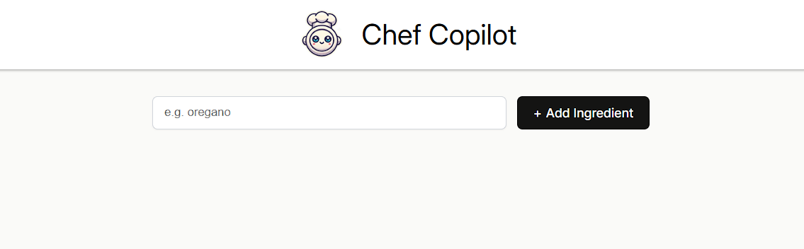
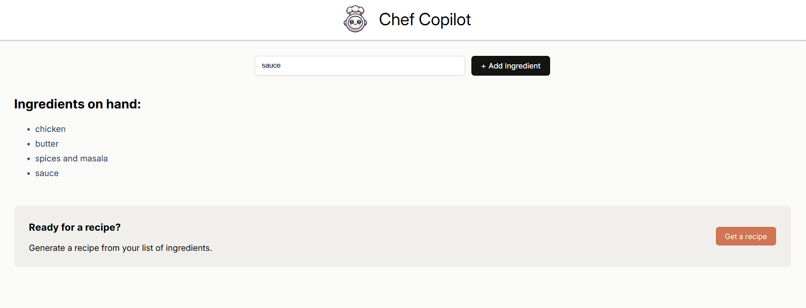
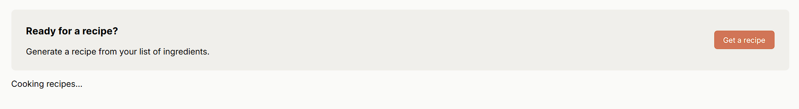
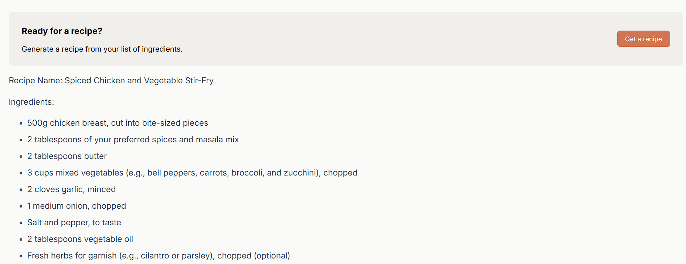

# Chef Copilot

An AI-based recipe platform. Add the ingredients, and AI will recommend a recipe based on the ingredients provided, built as a part of Scrimba Learn React.

## Environment Variables

To run this project, you will need to add the following environment variables to your .env file

`HF_ACCESS_TOKEN`: Use Hugging Face for the AI model

## Flow (screenshots)

**1️⃣ Add Ingredients**

**2️⃣ Hit Get a Recipe**

**3️⃣ Cooking Recipes**

**4️⃣ AI Recipe responses**

## Future Tasks

- Add History of recipes formed by a User
- Dark Mode

